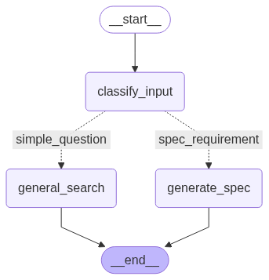

# Azure Migration을 위한 Cloud 리소스 설계 에이전트

## 개요

레거시 시스템을 Azure로 이전할 때 **초기 클라우드 리소스 설계를 사내 Azure 랜딩존 거버넌스 정책에 맞게 구성할 수 있도록** 도와주는 에이전드 입니다.

------

## 주요 기능

| 기능                                  | 설명                                                        |
| ------------------------------------- | ----------------------------------------------------------- |
| Azure 설계 가이드 기반 Q&A            | 사용자 질문에 대해 내부 설계 가이드 문서를 참조한 답변 제공 |
| AS-IS 스펙 요구사항 → TO-BE 스펙 제안 | 마이그레이션 관련 요구사항을 입력하면 스펙을 자동으로 생성  |

------

## 기술 스택

- **LangChain**: 체인 구성, 문서 검색, 프롬프트 템플릿 관리, 채팅 히스토리 저장
- **LangGraph**: LLM 흐름제어
- **Azure OpenAI**: GPT 기반 스펙 생성 및 답변
- **Azure AI Search**: 사내 가이드 문서 벡터 인덱싱
- **Streamlit**: 웹 UI
- **Python 3.13**

------

## 시스템 구성

## 프로젝트 구조

#### Lang Graph 구조

classify_input

* 요청에 대한 분류하는 노드입니다. 단순 정책 검색인지, 스펙 생성 요청인지 분류하여 다음 노드로 분기합니다.

* `gpt-4.1-mini`를 사용하여 요청을 분류합니다.

general_search

* 단순 정책에 대한 질문에 응답하는 노드입니다.
* `gpt-4.1-mini` + RAG를 사용하여 요청한 정책을 찾아 알려줍니다.

generate_spec

* AS-IS 스펙을 받아 TO-BE 설계를 해주는 노드입니다. 
* `gpt-4.1-mini` + RAG를 사용하여 요청한 정책을 찾고 해당 정책을 기준으로 `gpt-4.1`에 요청하여 상세 스펙을 뽑아냅니다.

------

## 실행 예시

### 일반 질문시

### TOBE 스펙 생성 요청시

